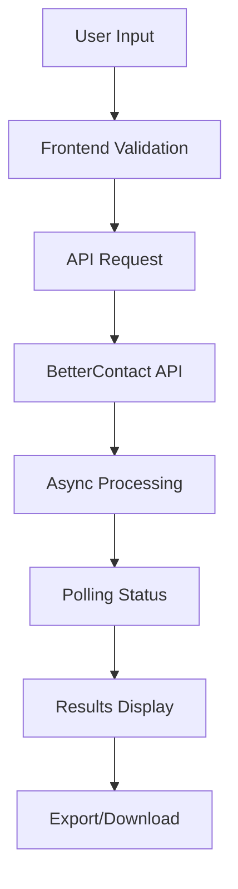

# 🚀 iSkala Enrich

> **AI-Powered Lead Enrichment Platform**  
> Transform your lead generation with advanced contact discovery and verification

[](https://nextjs.org/)
[](https://reactjs.org/)
[](https://www.typescriptlang.org/)
[](https://tailwindcss.com/)

## 📋 Table of Contents

- [Overview](#overview)
- [✨ Features](#-features)
- [🚀 Quick Start](#-quick-start)
- [📖 Usage Guide](#-usage-guide)
- [🔧 API Reference](#-api-reference)
- [🏗️ Architecture](#️-architecture)
- [⚙️ Configuration](#️-configuration)
- [🛠️ Development](#️-development)
- [📊 Pricing](#-pricing)
- [🤝 Contributing](#-contributing)
- [📄 License](#-license)

## 📖 Overview

iSkala Enrich is a powerful lead enrichment platform that helps sales teams discover hidden contact information using advanced AI algorithms and premium data providers. Whether you're looking for individual contacts or processing bulk lists, our platform provides accurate, verified contact data to supercharge your outbound campaigns.

### 🎯 What Makes iSkala Enrich Special?

- **🔍 Advanced Discovery**: Find contacts that 95% of other tools miss
- **💎 Verified Data**: Only pay for 100% valid, deliverable contacts
- **🤖 AI-Powered**: Smart algorithms connect to 20+ premium data providers
- **⚡ Real-time Processing**: Get results in seconds, not days
- **🛡️ Enterprise Security**: GDPR/CCPA compliant with enterprise-grade security

## ✨ Features

### 🎯 Individual Lead Enrichment
- **Email Discovery**: Find email addresses from names and company information
- **Phone Number Lookup**: Discover mobile numbers from LinkedIn profiles
- **Dual Enrichment**: Get both email and phone in one request
- **Real-time Results**: Instant processing with live status updates

### 📁 Bulk File Processing
- **Multi-format Support**: Upload CSV, XLSX, and Excel files
- **Smart Column Mapping**: Intuitive interface for field mapping
- **Progress Tracking**: Real-time monitoring of bulk operations
- **Export Options**: Download results in multiple formats

### 📊 Advanced Analytics
- **Success Metrics**: Track enrichment success rates
- **Cost Optimization**: Monitor credit usage and ROI
- **Data Quality**: Verify contact validity before payment
- **Export Reports**: Generate detailed enrichment reports

### 🔒 Enterprise Features
- **GDPR/CCPA Compliance**: Full regulatory compliance
- **Data Security**: Enterprise-grade encryption and security
- **API Access**: RESTful API for custom integrations
- **White-label Options**: Custom branding available

## 🚀 Quick Start

### Prerequisites

- **Node.js** 18+ ([Download](https://nodejs.org/))
- **npm** or **yarn** package manager
- **BetterContact API** key ([Get API Key](https://bettercontact.com/))

### Installation

1. **Clone the repository**
   ```bash
   git clone https://github.com/your-org/iskala-enrich.git
   cd iskala-enrich
   ```

2. **Install dependencies**
   ```bash
   npm install
   # or
   yarn install
   ```

3. **Set up environment variables**
   ```bash
   cp .env.example .env.local
   ```

4. **Configure your API key**
   ```env
   # .env.local
   BETTERCONTACT_API_KEY=your_bettercontact_api_key_here
   NEXT_PUBLIC_APP_NAME=iSkala Enrich
   NEXT_PUBLIC_APP_URL=http://localhost:3000
   ```

5. **Start development server**
   ```bash
   npm run dev
   ```

6. **Open your browser**
   Navigate to [http://localhost:3000](http://localhost:3000)

## 📖 Usage Guide

### Individual Lead Enrichment

1. **Navigate to Individual Lookup**
   - Go to `/enrich/individual` in your browser

2. **Select Enrichment Type**
   - **Email Only** (1 credit): First name, Last name, Company/Domain
   - **Phone Only** (10 credits): LinkedIn profile URL
   - **Both Email & Phone** (11 credits): Complete contact information

3. **Enter Contact Information**
   ```
   Email Enrichment:
   - First Name: John
   - Last Name: Smith
   - Company: Acme Corp
   - Domain: acmecorp.com
   
   Phone Enrichment:
   - LinkedIn URL: https://linkedin.com/in/johnsmith
   ```

4. **Start Enrichment**
   - Click "Start Enrichment" button
   - Monitor real-time progress
   - View results instantly

5. **Export Results**
   - Download enriched data as CSV
   - Copy individual results
   - Share with your team

### Bulk File Enrichment

1. **Prepare Your File**
   - Format: CSV, XLSX, or Excel
   - Include required columns (name, company, etc.)
   - Maximum 10,000 rows per file

2. **Upload and Map Columns**
   ```
   Required Fields:
   - First Name (or Full Name)
   - Last Name
   - Company Name
   - Domain (optional)
   - LinkedIn URL (for phone enrichment)
   ```

3. **Select Enrichment Options**
   - Choose email, phone, or both
   - Set batch size preferences
   - Configure export format

4. **Monitor Progress**
   - Real-time status updates
   - Success/failure tracking
   - Estimated completion time

5. **Download Results**
   - CSV export with all enriched data
   - Separate files for successful/failed records
   - Detailed enrichment reports

## 🔧 API Reference

### Authentication
All API requests require your BetterContact API key in the headers:
```bash
Authorization: Bearer YOUR_API_KEY
```

### Individual Enrichment
```http
POST /api/enrich/individual
Content-Type: application/json

{
  "data": [
    {
      "firstName": "John",
      "lastName": "Smith",
      "company": "Acme Corp",
      "domain": "acmecorp.com"
    }
  ],
  "enrich_email": true,
  "enrich_phone": false
}
```

### File Enrichment
```http
POST /api/enrich/file
Content-Type: application/json

{
  "data": [...],
  "enrich_email": true,
  "enrich_phone": true,
  "fileName": "leads.csv",
  "sheetName": "Sheet1"
}
```

### Results Polling
```http
GET /api/enrich/results?requestId=uuid-here
```

### Response Format
```json
{
  "success": true,
  "data": [
    {
      "id": "uuid",
      "firstName": "John",
      "lastName": "Smith",
      "email": "john.smith@acmecorp.com",
      "phone": "+1234567890",
      "confidence": 0.95,
      "source": "bettercontact"
    }
  ],
  "metadata": {
    "totalProcessed": 1,
    "successful": 1,
    "failed": 0,
    "creditsUsed": 11
  }
}
```

## 🏗️ Architecture

### Tech Stack

| Component | Technology | Version |
|-----------|------------|---------|
| **Frontend** | Next.js | 14 (App Router) |
| **UI Framework** | React | 18 |
| **Language** | TypeScript | 5 |
| **Styling** | TailwindCSS | 3 |
| **File Processing** | PapaParse, XLSX | Latest |
| **API Integration** | BetterContact API | v2 |
| **Notifications** | React Hot Toast | Latest |

### Project Structure
```
iskala-enrich/
├── app/                    # Next.js App Router
│   ├── api/               # API Routes
│   │   ├── enrich/        # Enrichment endpoints
│   │   ├── subscription/  # Subscription management
│   │   └── webhooks/      # Webhook handlers
│   ├── auth/              # Authentication pages
│   ├── dashboard/         # Main dashboard
│   ├── enrich/            # Enrichment pages
│   └── pricing/           # Pricing page
├── components/            # Reusable React components
├── contexts/              # React contexts
├── lib/                   # Utility libraries
├── utils/                 # Helper functions
└── public/                # Static assets
```

### Data Flow


## ⚙️ Configuration

### Environment Variables

| Variable | Description | Required | Default |
|----------|-------------|----------|---------|
| `BETTERCONTACT_API_KEY` | Your BetterContact API key | ✅ | - |
| `NEXT_PUBLIC_APP_NAME` | Application display name | ❌ | iSkala Enrich |
| `NEXT_PUBLIC_APP_URL` | Application URL | ❌ | http://localhost:3000 |
| `DATABASE_URL` | Database connection string | ❌ | - |
| `STRIPE_SECRET_KEY` | Stripe secret key | ❌ | - |
| `STRIPE_WEBHOOK_SECRET` | Stripe webhook secret | ❌ | - |

### BetterContact API Configuration

The app integrates with BetterContact API v2 for lead enrichment:

- **Async Processing**: Uses `/api/v2/async` for batch operations
- **Polling Strategy**: Checks status every 10 seconds
- **Custom Fields**: Adds UUID and list name for tracking
- **Error Handling**: Graceful error handling with user feedback

## 🛠️ Development

### Available Scripts

```bash
# Development
npm run dev          # Start development server
npm run build        # Build for production
npm run start        # Start production server

# Code Quality
npm run lint         # Run ESLint
npm run type-check   # Run TypeScript checks
npm run format       # Format code with Prettier

# Testing
npm run test         # Run unit tests
npm run test:watch   # Run tests in watch mode
npm run test:coverage # Generate coverage report
```

### Development Workflow

1. **Fork the repository**
2. **Create a feature branch**
   ```bash
   git checkout -b feature/your-feature-name
   ```
3. **Make your changes**
4. **Run tests and linting**
   ```bash
   npm run lint
   npm run type-check
   npm run test
   ```
5. **Commit your changes**
   ```bash
   git commit -m "feat: add new feature"
   ```
6. **Push and create PR**
   ```bash
   git push origin feature/your-feature-name
   ```

### Code Style

- **TypeScript**: Strict mode enabled
- **ESLint**: Airbnb configuration
- **Prettier**: Consistent code formatting
- **Conventional Commits**: Standard commit message format

## 📊 Pricing

### Credit System

| Service | Credits | Description |
|---------|---------|-------------|
| **Email Enrichment** | 1 credit | Find email addresses from names and company info |
| **Phone Enrichment** | 10 credits | Discover mobile numbers from LinkedIn profiles |
| **Dual Enrichment** | 11 credits | Get both email and phone in one request |

### Plans

| Plan | Price | Credits | Features |
|------|-------|---------|----------|
| **Starter** | $49/month | 1,000 | Basic enrichment, CSV export |
| **Professional** | $149/month | 5,000 | Advanced features, API access |
| **Enterprise** | Custom | Unlimited | White-label, custom integrations |

### Cost Optimization Tips

- **Batch Processing**: Process multiple leads together for better rates
- **Data Quality**: Use verified company domains for higher success rates
- **LinkedIn URLs**: Provide complete LinkedIn URLs for phone enrichment
- **Export Strategy**: Download results promptly to avoid storage costs

## 🤝 Contributing

We welcome contributions from the community! Here's how you can help:

### How to Contribute

1. **Fork the repository**
2. **Create a feature branch**
3. **Make your changes**
4. **Add tests for new features**
5. **Ensure all tests pass**
6. **Submit a pull request**

### Contribution Guidelines

- **Code Style**: Follow existing patterns and conventions
- **Testing**: Add tests for new features and bug fixes
- **Documentation**: Update docs for new features
- **Commits**: Use conventional commit messages
- **PRs**: Provide clear descriptions and screenshots

### Development Setup

```bash
# Clone your fork
git clone https://github.com/your-username/iskala-enrich.git
cd iskala-enrich

# Add upstream remote
git remote add upstream https://github.com/original-owner/iskala-enrich.git

# Install dependencies
npm install

# Set up environment
cp .env.example .env.local
# Edit .env.local with your API keys

# Start development
npm run dev
```

## 📄 License

This project is licensed under the **MIT License** - see the [LICENSE](LICENSE) file for details.

### License Terms

- ✅ **Commercial Use**: Use in commercial projects
- ✅ **Modification**: Modify and distribute
- ✅ **Distribution**: Distribute copies
- ✅ **Private Use**: Use privately
- ❌ **Liability**: No warranty provided
- ❌ **Warranty**: No warranty provided

---

## 📞 Support

- **Email**: support@iskala.com
- **Documentation**: [docs.iskala.com](https://docs.iskala.com)
- **Issues**: [GitHub Issues](https://github.com/your-org/iskala-enrich/issues)
- **Discord**: [Join our community](https://discord.gg/iskala)

## 🙏 Acknowledgments

- **BetterContact** for providing the enrichment API
- **Next.js team** for the amazing framework
- **TailwindCSS** for the utility-first CSS framework
- **All contributors** who help improve this project

---

<div align="center">

**Made with ❤️ by the iSkala Team**

[](https://github.com/your-org/iskala-enrich)
[](https://github.com/your-org/iskala-enrich)
[](https://github.com/your-org/iskala-enrich/issues)

</div> 